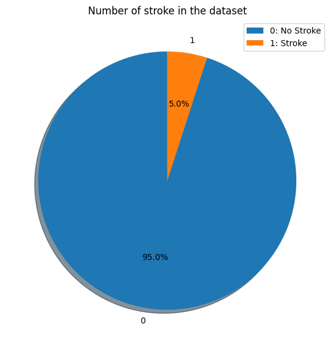

# Stroke Prediction Using Machine Learning

Machine Learning tool to predict risk of having stroke.

Repo Github: 

## Domain Background

Stroke is a medical condition that occurs when blood supply to the brain is interrupted or reduced, resulting in the death of brain cells. It is a leading cause of disability and death worldwide. Early detection and timely intervention are crucial for improving stroke outcomes. Data science and machine learning techniques can play a significant role in predicting stroke risk and assisting healthcare professionals in making informed decisions.

# Problem Statement

The problem addressed in this project is to predict the likelihood of an individual experiencing a stroke based on their demographic and health-related attributes. By leveraging a dataset containing information about patients, we aim to build a predictive model that can assist in identifying individuals at risk of stroke and potentially guide preventive measures.

## Dataset

The dataset used in this project is the [Brain Stroke Dataset](https://www.kaggle.com/datasets/jillanisofttech/brain-stroke-dataset/data) available on Kaggle. It contains information about individuals and their attributes related to stroke, such as age, gender, hypertension, heart disease, smoking status, and more. The dataset provides a valuable resource for training and evaluating machine learning models for stroke prediction.

## Solution Statement

The project's solution involves developing a machine learning model that can accurately predict the likelihood of stroke based on the provided dataset. By applying various classification algorithms and techniques, we aim to build a predictive model that achieves high accuracy and can be used as a tool for stroke risk assessment.

## Analysis
### Question 1: What is the ratio of stroke patients to non-stroke patients in this dataset and it follows the same ratio in the real world?
The ratio of stroke patients to non-stroke patients in this dataset is 1:24. It is not the same ratio in the real world. The ratio of stroke patients to non-stroke patients in the real world is 1:6.

### Question 2: Is there any difference between gender and stroke?

The relationship between male and female are the same in `heart_disease` and `residence_type`. But with hypertension features, the ratio of males is greater than females.

### Question 3: What is the relationship between age and stroke?

The relationship between age and stroke is positive. The older the age, the higher the risk of stroke.

### Correlation
We can see that the correlation between `age` and `stroke` and `married` is greater than 0.7.

## Conclusion
- Dataset is imbalanced in `stroke` feature.
- The ratio of stroke patients to non-stroke patients in this dataset is 1:24. It is not the same ratio in the real world. The ratio of stroke patients to non-stroke patients in the real world is 1:6.
- The relationship between age and stroke is positive. The older the age, the higher the risk of stroke.